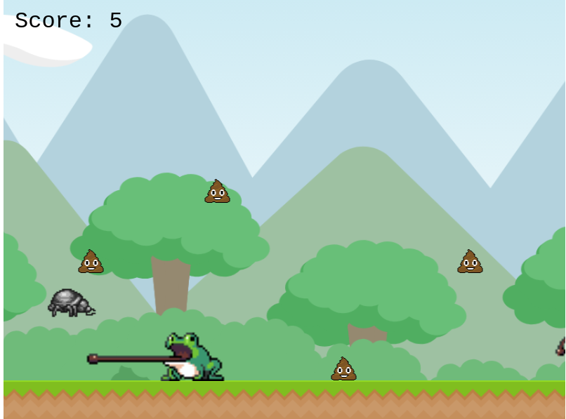

# Beetle Rush

> A platform game built with Phaser 3 that makes a dung beetle run through the forest while collecting manure and avoiding predators!

## Built With

- HTML5 & JavaScript
- Phaser 3
- Webpack 

## Live Demo

Play the live demo [here](https://adoring-goldstine-1746f4.netlify.app/)!!

## Getting Started

To get a local copy up and running follow these simple example steps.

### Setup and Install

- Clone this repository using the link above (click on the 'code' button)
- Open a terminal and `cd` to the cloned repository
- Once you're in the root (the outer most) directory of the proyect, run `npm install`
- Run `npm start` to start a server (this will open a new tab in your default browser) 
- If the browser did not open after starting the server, open your preferred browser and go to `http://localhost:8080/`

### Tests

- Open `npm run test` to run the tests

### Usage

#### Play
- To play the game, click on the "Play" button
- Press the UP key to jump
- Press the UP key twice to make a double jump
- Collect as much dung as you can you earn points
- Avoid frogs by jumping over their heads
- If two frogs appear very close to each other, use the double jump to evade them both!

#### Save your score
- When the game is over, you can choose between saving your score or going back to the main menu
- If you choose "Save", you will check the leaderboard. If your score is among the top five, you will see your name in the leaderboard!!

## Game Design (GDD)

### Main goal

> To develop a platform game in which a moving background would create the illusion of a moving character, with collectable objects and enemies that end the game when they hit the player. 

### The original idea

> What's so great about dung beetles anyway?

When I worked in ecological agriculture I grew a certain fondness for these little folks. They play a huge role in recycling organic matter in forests and farming systems!
I decided to develop this game to share my passion for nature, education and programming, while learning a new framework.

### Gather and prepare the assets

I made a list of all the assets I would require:
- A background and logo images
- A tile to use as platform
- Sprite sheets for the player, dung(coins) and enemies
- A nice background music to give my game a happy and exciting mood
- Buttons and checkboxes

I looked for assets in open source art websites, such as [OpenGameArt.org](https://opengameart.org/)

### Development stage

#### 1. Set the beetle's habitat

Dung beetles live happier in diverse landscapes, with lots of forest and grassland to hang around. The goal while setting up the backgroud and platform was to give the player the feeling of a dynamic and diverse environment.
This environment is made by two parts:

- A scrolling background
- A scrolling ground with grass

This was accomplished by using tileSprites feature from Phaser.

#### 2. Add the player

- Bring the dung beetle into scene and set an animation to make it run
- Make it jump with the up key
- Add double jump

#### 3. Add dung to collect

- Use object pooling to create dung "coins"
- Set a collider object with the player, so when the dung "touches" a dung coin, it dissapears and the player gets 5 points

#### 4. Add enemies

I asked a friend who happens to be a dung beetle specialist: "What are common predators for dung beetles?"
Her answer was "birds, frogs and toads"

The process for adding frogs to the game was similar to adding the dung coins, with some slight differences: 
- Instead of being single-frame objects, I made them move by adding a simple but cool animation to the frogs
- I reduced the size of the collidable body to be nicer with the player

#### 5. Implement a scoring system

Because JavaScript is much more exciting with asynchronous code, I implemented a leaderboard that uses an API to save and retreive scores. 

#### 6. Testing the user experience 

Once the game was over I asked some friends and family to test the game :beetle:

### Deployment

- Deployed on Netlify

## Authors

👤 **Alicia Rojas**

- GitHub: [@aliciapaz](https://github.com/aliciapaz)
- Twitter: [@_alicia_paz](https://twitter.com/_alicia_paz)
- LinkedIn: [Alicia Rojas](https://www.linkedin.com/in/aliciapazrojas/)

## 🤝 Contributing

Contributions, issues, and feature requests are welcome!

Feel free to check the [issues page](https://github.com/aliciapaz/beetle-rush/issues).

## Show your support

Give a ⭐️ if you like this project!

## Acknowledgments

- Track "Shake and bake" by [Matthew Pablo](https://matthewpablo.com/)
- Phaser & Webpack template by [Richard Davey](https://github.com/photonstorm)

## 📝 License

This project is [MIT](LICENSE) licensed.
